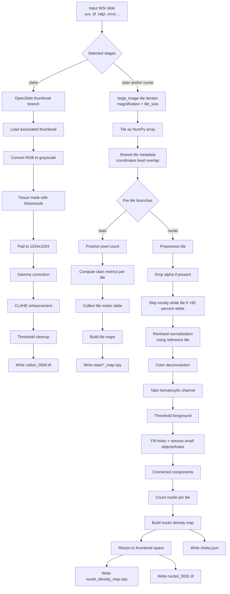

# Unified Histology Pipeline

This folder contains the new unified pipeline for histology processing.

It can run three stages:
- `clahe`
- `stain`
- `nuclei`

By default, `--all` runs all three.

## Files

- [run_slide.py](/exafs1/well/parkkinen/users/nfw313/final_scripts/unified_pipeline/run_slide.py): run the pipeline for one slide
- [run_folder.py](/exafs1/well/parkkinen/users/nfw313/final_scripts/unified_pipeline/run_folder.py): run the pipeline for a whole folder of slides
- [run_slide_job.sh](/exafs1/well/parkkinen/users/nfw313/final_scripts/unified_pipeline/run_slide_job.sh): submit one slide to SLURM with `sbatch`
- [pipeline.py](/exafs1/well/parkkinen/users/nfw313/final_scripts/unified_pipeline/pipeline.py): main implementation

## Output Layout

For one slide, output looks like:

```text
<OUTPUT>/<SLIDE_NAME>/
  clahe/
  stain/
  nuclei/
```

## Pipeline Schematic



## Step-By-Step

### 1. Input

Input to the pipeline is one WSI file, for example:

```text
/exafs1/well/parkkinen/users/nfw313/images/00-1006-A-IBA1.svs
```

The pipeline can run one or more stages:
- `clahe`
- `stain`
- `nuclei`

### 2. CLAHE Branch

This is a thumbnail-based branch, not a full-tile branch.

Input:
- whole-slide thumbnail from `OpenSlide`

What happens:
- load `associated_images["thumbnail"]`
- convert RGB thumbnail to grayscale
- detect tissue mask with `histomicstk.saliency.tissue_detection.get_tissue_mask`
- keep only tissue pixels
- center-pad to `1024 x 1024`
- apply gamma correction
- apply CLAHE
- zero out very small values

Output:
- `clahe/<stem>_0000.tif`

### 3. Shared Tile Iterator

This is the main full-slide branch for `stain` and `nuclei`.

Input:
- same WSI file
- analysis magnification
- tile size

What happens:
- `large_image` opens the slide
- `tileIterator(...)` walks across the slide
- each tile is returned as a NumPy array
- tile metadata is preserved:
  - tile coordinates
  - global coordinates
  - scale info
  - overlap info
  - iterator position info

This shared iterator is the core optimization:
- the slide is traversed once
- stain and nuclei are both computed from the same tile buffer

### 4. Stain Branch

Input:
- tile NumPy array
- tile metadata
- positive pixel count parameters

What is calculated:
- `histomicstk.segmentation.positive_pixel_count.count_image(...)`
- per-tile staining metrics including values like:
  - `IntensitySumPositive`
  - `NumberPositive`
  - `NumberTotalPixels`
  - derived `PercentagePositive`

What happens after all tiles:
- tile-level results are collected into a DataFrame
- metric grids are built by tile position

Output:
- `stain/<stem>_IntensitySumPositive_map.npy`
- `stain/<stem>_NumberPositive_map.npy`
- `stain/<stem>_PercentagePositive_map.npy`

### 5. Nuclei Branch

Input:
- tile NumPy array
- tile metadata
- reference tile `.npy` for normalization

What is calculated per tile:
- remove alpha channel if present
- estimate how white the tile is
- skip the tile if it is mostly background
- apply Reinhard color normalization
  - this normalizes tile color distribution to match a reference tile
  - goal: reduce stain/color variation across slides
- perform color deconvolution
  - separate stain channels using a stain matrix
- extract hematoxylin channel
  - this acts as the nuclei-focused channel
- threshold foreground
- fill holes
- remove small objects
- remove small holes
- run connected-component labeling
- count labeled nuclei objects

What happens after all tiles:
- nuclei counts are written into a 2D tile-grid density map
- density map is resized to thumbnail size
- resized map is padded to `1024 x 1024`
- metadata is saved

Output:
- `nuclei/nuclei_density_map.npy`
- `<sample>/meta.json`
- `nuclei/<stem>_0001.tif`

### 6. Parallelism

The tile branch currently uses:
- `ProcessPoolExecutor`
- one process per worker
- one shared tile iterator in the parent process
- stain/nuclei computation in child processes

This is meant to avoid GIL-limited CPU parallelism for the heavy per-tile work.

### 7. Logging and Performance Signals

The pipeline logs:
- stage start/finish
- tile count
- periodic progress
- ETA
- tile wall time
- child CPU time
- parallelism efficiency

These help answer:
- is the pipeline CPU-bound?
- is it mostly waiting on slide I/O?
- are multiple workers actually being used effectively?

## Environment

Use:

```bash
/exafs1/well/parkkinen/users/nfw313/python-venvs/histomics-env/bin/python
```

## Run One Slide

Run everything:

```bash
/exafs1/well/parkkinen/users/nfw313/python-venvs/histomics-env/bin/python \
  /exafs1/well/parkkinen/users/nfw313/final_scripts/unified_pipeline/run_slide.py \
  /exafs1/well/parkkinen/users/nfw313/images/00-1006-A-IBA1.svs \
  /exafs1/well/parkkinen/users/nfw313/histoprocessor_outputs/unified_test/00-1006-A-IBA1 \
  --all
```

Run only `stain` and `nuclei`:

```bash
/exafs1/well/parkkinen/users/nfw313/python-venvs/histomics-env/bin/python \
  /exafs1/well/parkkinen/users/nfw313/final_scripts/unified_pipeline/run_slide.py \
  /exafs1/well/parkkinen/users/nfw313/images/00-1006-A-IBA1.svs \
  /exafs1/well/parkkinen/users/nfw313/histoprocessor_outputs/unified_test/00-1006-A-IBA1 \
  --stain --nuclei
```

Run only `clahe`:

```bash
/exafs1/well/parkkinen/users/nfw313/python-venvs/histomics-env/bin/python \
  /exafs1/well/parkkinen/users/nfw313/final_scripts/unified_pipeline/run_slide.py \
  /exafs1/well/parkkinen/users/nfw313/images/00-1006-A-IBA1.svs \
  /exafs1/well/parkkinen/users/nfw313/histoprocessor_outputs/unified_test/00-1006-A-IBA1 \
  --clahe
```

## Run One Slide Through SLURM

Run everything:

```bash
sbatch /exafs1/well/parkkinen/users/nfw313/final_scripts/unified_pipeline/run_slide_job.sh \
  /exafs1/well/parkkinen/users/nfw313/images/00-1006-A-IBA1.svs \
  /exafs1/well/parkkinen/users/nfw313/histoprocessor_outputs/unified_test/00-1006-A-IBA1 \
  all
```

Run only `stain+nuclei`:

```bash
sbatch /exafs1/well/parkkinen/users/nfw313/final_scripts/unified_pipeline/run_slide_job.sh \
  /exafs1/well/parkkinen/users/nfw313/images/00-1006-A-IBA1.svs \
  /exafs1/well/parkkinen/users/nfw313/histoprocessor_outputs/unified_test/00-1006-A-IBA1 \
  stain+nuclei
```

Available modes for `run_slide_job.sh`:
- `all`
- `clahe`
- `stain`
- `nuclei`
- `stain+nuclei`

## Run Whole Folder

Run the whole `images/` folder:

```bash
/exafs1/well/parkkinen/users/nfw313/python-venvs/histomics-env/bin/python \
  /exafs1/well/parkkinen/users/nfw313/final_scripts/unified_pipeline/run_folder.py \
  /exafs1/well/parkkinen/users/nfw313/images \
  /exafs1/well/parkkinen/users/nfw313/histoprocessor_outputs/unified_batch \
  --all
```

Example with explicit parameters:

```bash
/exafs1/well/parkkinen/users/nfw313/python-venvs/histomics-env/bin/python \
  /exafs1/well/parkkinen/users/nfw313/final_scripts/unified_pipeline/run_folder.py \
  /exafs1/well/parkkinen/users/nfw313/images \
  /exafs1/well/parkkinen/users/nfw313/histoprocessor_outputs/unified_batch \
  --stain --nuclei \
  --workers 16 \
  --tile-size 512 \
  --magnification 40
```

## Important Behavior

- `run_slide.py` overwrites output files in the target output folder
- `run_folder.py` skips a slide if its output folder already exists
- `run_folder.py --force` reruns slides even if output already exists

## Useful Options

- `--all`
- `--clahe`
- `--stain`
- `--nuclei`
- `--workers`
- `--tile-size`
- `--magnification`
- `--reference-image`
- `--force` for `run_folder.py`

## Logging

SLURM and pipeline logs now include:
- timestamps
- `[histoprocessor]` prefix
- CLAHE start/finish
- tile-pass start
- tile count
- progress updates with ETA
- tile wall time
- child CPU time
- parallelism efficiency

This helps tell whether the pipeline is CPU-bound or I/O-bound.

## Typical Commands

Run one slide locally:

```bash
/exafs1/well/parkkinen/users/nfw313/python-venvs/histomics-env/bin/python \
  /exafs1/well/parkkinen/users/nfw313/final_scripts/unified_pipeline/run_slide.py \
  /exafs1/well/parkkinen/users/nfw313/images/00-1006-A-IBA1.svs \
  /exafs1/well/parkkinen/users/nfw313/histoprocessor_outputs/unified_test/00-1006-A-IBA1 \
  --all
```

Run one slide with SLURM:

```bash
sbatch /exafs1/well/parkkinen/users/nfw313/final_scripts/unified_pipeline/run_slide_job.sh \
  /exafs1/well/parkkinen/users/nfw313/images/00-1006-A-IBA1.svs \
  /exafs1/well/parkkinen/users/nfw313/histoprocessor_outputs/unified_test/00-1006-A-IBA1 \
  all
```

Run whole folder:

```bash
/exafs1/well/parkkinen/users/nfw313/python-venvs/histomics-env/bin/python \
  /exafs1/well/parkkinen/users/nfw313/final_scripts/unified_pipeline/run_folder.py \
  /exafs1/well/parkkinen/users/nfw313/images \
  /exafs1/well/parkkinen/users/nfw313/histoprocessor_outputs/unified_batch \
  --all
```

Run whole folder through SLURM:

```bash
sbatch --wrap="/exafs1/well/parkkinen/users/nfw313/python-venvs/histomics-env/bin/python /exafs1/well/parkkinen/users/nfw313/final_scripts/unified_pipeline/run_folder.py /exafs1/well/parkkinen/users/nfw313/images /exafs1/well/parkkinen/users/nfw313/histoprocessor_outputs/unified_batch --all"
```
